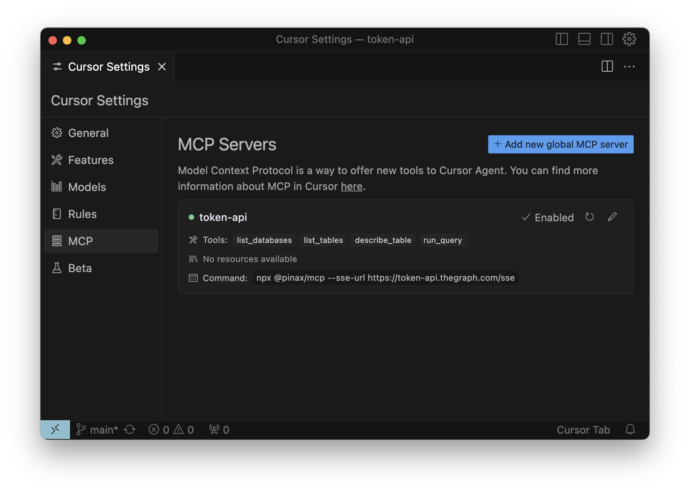

**Cursor** - The AI Code Editor Built to make you extraordinarily productive, Cursor is the best way to code with AI.

> https://www.cursor.com/

import Authentication from '/snippets/authentication.mdx';
import NpmInstall from '/snippets/npm-install.mdx';
import Troubleshooting from '/snippets/troubleshooting.mdx';
import McpServers from '/snippets/mcp-servers.mdx';

<Authentication />

## Configuration

<NpmInstall />

You will need to either create or edit your `~/.cursor/mcp.json` file.

> **Cursor Settings** > **MCP** > **Add new global MCP ServerConfigure MCP Servers**

<McpServers/>

---

<Troubleshooting />

> Failed to create client

